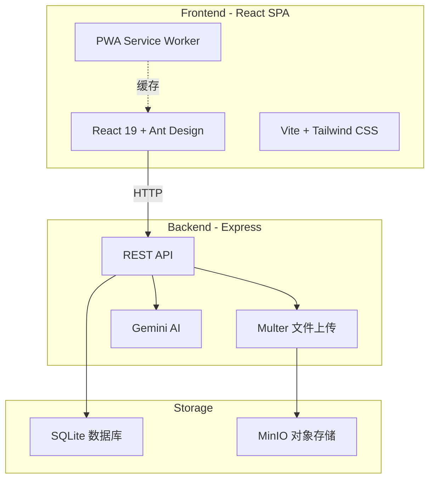
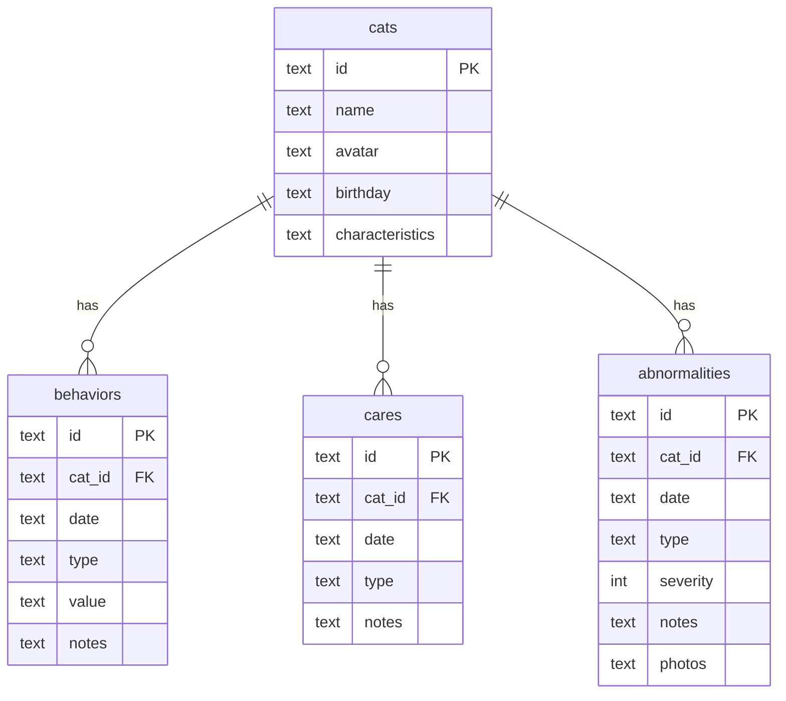

# 小猫成长日记 Kitten Growth Diary

一款为铲屎官打造的小猫成长记录应用，记录猫咪的体重变化、可爱瞬间、日常看护和健康异常，支持 AI 图像分析和智能问答。

## 功能概览

| 模块 | 说明 |
|------|------|
| **看板** | 体重趋势图、日历事件总览（看护 + 异常） |
| **可爱瞬间** | 上传照片/音频/视频，记录体重，瀑布流展示 |
| **看护记录** | 刷牙、驱虫、益生菌等日常护理的快速打卡与详细记录 |
| **异常记录** | 就医、呕吐、软便等异常事件，支持严重度评级和照片附件 |
| **基本信息** | 猫咪档案：头像、生日、性格特征，生日倒计时 |
| **每日随机** | 从历史照片中随机抽取一张，回忆美好瞬间 |
| **AI 分析** | 基于 Gemini 的猫咪图像分析和智能问答 |

## 技术架构



## 数据模型



## 技术栈

- **前端**: React 19, Vite 6, Ant Design 6, Tailwind CSS 4, Recharts, Framer Motion
- **后端**: Express 4, better-sqlite3, Multer
- **存储**: SQLite (结构化数据), MinIO (文件对象存储)
- **AI**: Google Gemini API
- **部署**: Docker + Docker Compose

## 快速开始

### 前置要求

- Node.js >= 18
- pnpm (推荐) 或 npm
- MinIO 服务（本地开发可用 Docker 启动）

### 本地开发

```bash
# 1. 安装依赖
pnpm install

# 2. 配置环境变量
cp .env.example .env
# 编辑 .env，填入你的 GEMINI_API_KEY 和 MinIO 配置

# 3. 启动开发服务器
pnpm dev
# 访问 http://localhost:3000
```

### Docker 部署

```bash
# 一键启动（包含 MinIO）
docker compose up -d

# 访问应用: http://localhost:3000
# MinIO 控制台: http://localhost:9001 (minioadmin / minioadmin)
```

## 环境变量

参考 [.env.example](.env.example)：

| 变量 | 说明 | 默认值 |
|------|------|--------|
| `GEMINI_API_KEY` | Google Gemini API 密钥 | - |
| `PORT` | 服务端口 | `3000` |
| `NODE_ENV` | 运行环境 | `development` |
| `MINIO_ENDPOINT` | MinIO 服务地址 | `localhost` |
| `MINIO_PORT` | MinIO 服务端口 | `9000` |
| `MINIO_USE_SSL` | 是否启用 SSL | `false` |
| `MINIO_ACCESS_KEY` | MinIO 访问密钥 | `minioadmin` |
| `MINIO_SECRET_KEY` | MinIO 密钥 | `minioadmin` |
| `MINIO_BUCKET` | 存储桶名称 | `kitten-diary` |

## 项目结构

```
├── src/
│   ├── components/     # React 组件
│   │   ├── Dashboard.tsx
│   │   ├── Moments.tsx
│   │   ├── Cares.tsx
│   │   ├── Abnormalities.tsx
│   │   ├── CatProfile.tsx
│   │   └── DailyRandom.tsx
│   ├── App.tsx          # 主应用（路由、布局）
│   ├── types.ts         # TypeScript 类型定义
│   ├── i18n.ts          # 中英文国际化
│   ├── index.css        # 全局样式 + Clay 设计系统
│   └── main.tsx         # 入口
├── server.ts            # Express 后端 + API
├── index.html           # HTML 入口
├── vite.config.ts       # Vite 配置
├── Dockerfile           # Docker 镜像构建
├── docker-compose.yml   # 一键部署编排
└── .env.example         # 环境变量模板
```

## License

[MIT License](LICENSE)
